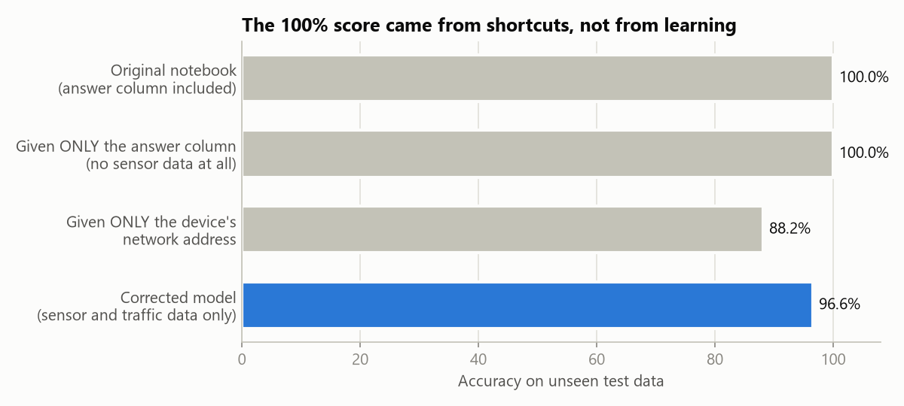
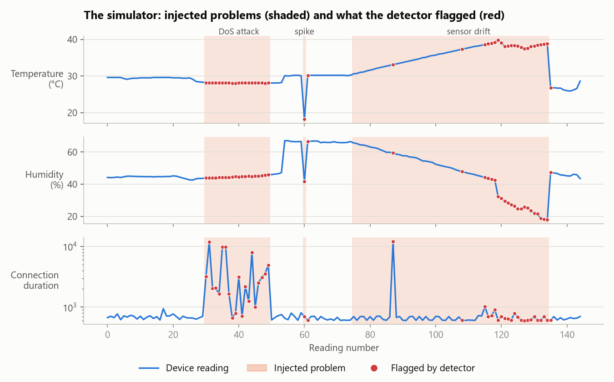
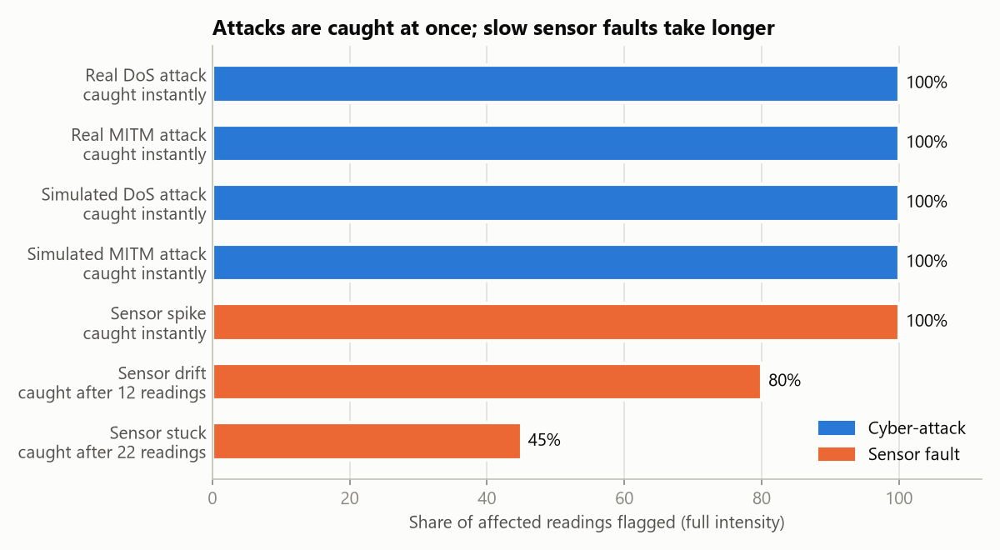
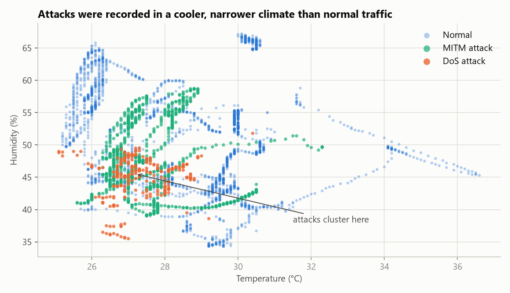

# AI-Driven Anomaly Detection for Home IoT

An AI system that watches a smart-home device and raises an alarm when something is wrong,
whether that's a cyber-attack or a faulty sensor. It comes with an interactive simulator: you
create problems on purpose and watch whether the AI catches them.

## The problem

Smart-home devices such as thermostats and humidity sensors are connected to the internet.
That makes them useful, but it also means they can be attacked, and like any hardware their
sensors can fail. Most homes have no one watching these devices. A problem can go unnoticed
for a long time: a heating system acting on fake readings, or a device knocked offline.

The goal of this project is a system that spots these problems automatically, reading by
reading, as they happen.

## What counts as a problem

| Problem | What it means | Real-world example |
|---|---|---|
| **DoS attack** (Denial of Service) | An attacker floods the device with traffic so it can't do its job. | The thermostat stops responding and the heating can't be controlled. |
| **MITM attack** (Man-in-the-Middle) | An attacker secretly sits between the device and the network, reading or changing the data. | The app shows 21 °C while the room is really 28 °C. |
| **Sensor spike** | A single reading jumps to an impossible value, then returns to normal. | A loose wire or electrical glitch. |
| **Sensor drift** | Readings slowly creep away from the truth. | An ageing sensor that reads a little higher every day. |
| **Sensor stuck** | The sensor keeps reporting exactly the same value. | A frozen or dead sensor that still looks "online". |

## Why the original 100% accuracy was wrong

The first version of this project ([Iot.ipynb](Iot.ipynb)) reported **100% accuracy**. That
sounds perfect, but in machine learning a perfect score on real-world data is a warning sign,
not a success. When we looked closer, the model had been given the answers.

Think of an exam where the answer is printed next to every question. A student would score
100% without understanding anything, and would fail the moment the answers were taken away.
That is what happened here:

1. **The answer was one of the inputs.** The dataset has a column called `Type` ("normal",
   "dos" or "mitm"). It is simply the answer written as a word, and the model was allowed to
   read it. Given *only* that column and no sensor data at all, the model still scores 100%.
2. **The attacker's computer could be recognised.** In this dataset, some network addresses
   only ever sent attacks. Given only the address, the model scores 88% by memorising "this
   address means attack". In a real home, attackers don't use a known address.
3. **The same rows appeared twice.** 106 readings were exact duplicates, so some test
   questions had already been seen, answer included, during training.



With these shortcuts removed, the model has to learn from what a real detector would actually
see: sensor readings and network traffic. Its honest accuracy is **96.6%**. That number is
lower, but it is the one that tells us how the system would behave in a real home.
[notebooks/01_training_fixed.ipynb](notebooks/01_training_fixed.ipynb) walks through each step.

## The solution

The system checks every reading in three independent ways (three "layers"). An alarm is
raised if any of them is worried:

1. **Attack recogniser** (Random Forest). Learned from past examples what DoS and MITM
   attacks look like, and says which type it thinks it is seeing.
2. **"Is this unusual?" detector** (Isolation Forest). Learned only what normal looks like, and
   flags anything that doesn't fit, including problems it has never seen before.
3. **Sensor sanity checks.** Simple rules learned from normal data: is the value physically
   plausible, did it change impossibly fast, has it stopped changing altogether?

The **simulator** feeds the system a stream of device readings. With one click you can inject
any of the five problems, at any strength, and watch what gets caught and how quickly.



## Results

Tested on data the models had never seen:

- **Honest accuracy:** 96.6% at telling normal from attack, and 95.3% at naming the attack type.
- **Attacks caught:** 97.6% of real attack readings.
- **False alarms:** 2–5% of normal readings are wrongly flagged, depending on the test.



Attacks and sudden spikes are caught immediately. Slow problems (drift, a stuck sensor) take
longer, because they only become suspicious once they have gone on for a while.

## Limitations

- **The model partly learned the weather.** All the attacks in the dataset were recorded while
  the room happened to be cooler and drier than usual, so the model learned, in part, that
  "cool and dry" means "attack". When the simulator feeds it room conditions it hasn't seen
  before, false alarms rise from 2% to about 10%, with no attack at all. The real fix is more
  data, with attacks recorded at different times of day.

  

- **Small dataset from one setup.** 4,108 readings from a single test environment. Results
  may differ on other homes and devices.
- **Simulated attacks are approximations.** The "real" attacks in the simulator replay actual
  recorded attacks. The "simulated" ones are our best model of how those attacks behave.

---

## Running it

<details>
<summary>Setup, web app, tests and deployment</summary>

**Setup (Windows, PowerShell)**

```powershell
python -m venv .venv
.\.venv\Scripts\Activate.ps1
pip install -r requirements-dev.txt
pip install -e .
python -m ipykernel install --user --name iot-detector --display-name "Python (iot-detector)"
```

**Use**

```powershell
streamlit run app/streamlit_app.py   # web simulator at http://localhost:8501
python -m iot_detector.train         # retrain the models
python docs/make_figures.py          # regenerate the README figures
pytest                               # run the tests
```

Notebooks:
- `notebooks/01_training_fixed.ipynb`: the corrected training, step by step.
- `notebooks/02_simulator_widgets.ipynb`: the simulator inside Jupyter.
- `Iot.ipynb`: the original notebook, kept for comparison.

**Deploy with Docker** (any host: a VM, Render, Railway, Fly.io, Azure, etc.)

```powershell
docker build -t iot-anomaly-simulator .
docker run -p 8501:8501 iot-anomaly-simulator
```

- **Port:** the container listens on `$PORT` (default 8501). On Hugging Face Spaces, use a
  Docker Space with `app_port: 7860` and set `PORT=7860`.
- **Streamlit Community Cloud:** set the main file to `app/streamlit_app.py`.
- **Models:** the trained models (1.7 MB) are committed, so no training step is needed to deploy.

**Project layout**

```
app/streamlit_app.py      web simulator
data/iot_dataset.csv      dataset
docs/                     README figures and the script that makes them
models/                   trained models and metadata
notebooks/                corrected training and Jupyter simulator
src/iot_detector/         detector, simulator, anomaly injectors, training code
tests/
```

</details>
